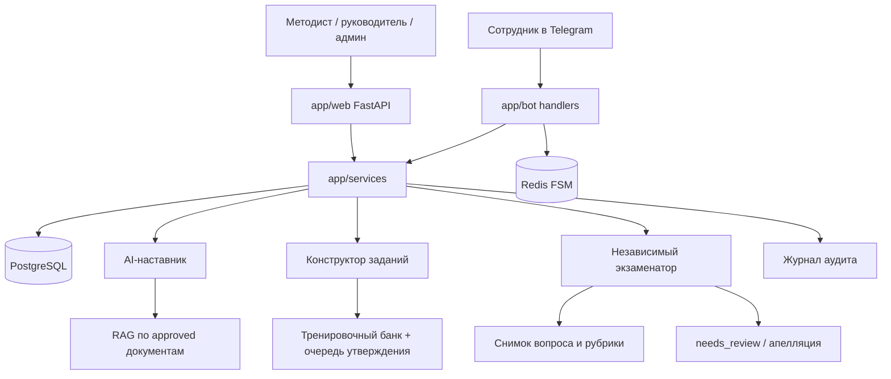

# Архитектура AI-наставник 360

Монолит Python 3.12: FastAPI (web) + aiogram 3 (Telegram polling) + PostgreSQL + Redis.
Компоненты AI разделены по модулям и контрактам JSON. Квалификацию не подтверждает одна нейросеть.

## Решения этапа 1

- Корень кода: `app/` в репозитории.
- LLM: OpenAI-совместимый клиент + `StubProvider` при `LLM_ENABLED=false`.
- Telegram: polling.
- Redis обязателен в Compose (FSM, позже кэш и лимиты).
- Демо-экзамен (этап 5): закрытые вопросы считает сервер; открытые и низкая уверенность → `needs_review`.

## Компоненты AI

| Компонент | Модуль | Делает | Не делает |
|-----------|--------|--------|-----------|
| A. Наставник | `app/ai/mentor` | объясняет, тренирует, цитирует источники | не ставит итоговую квалификацию |
| B. Конструктор | `app/ai/question_generator` | только тренировочные вопросы с `requires_approval=true` | не кладёт вопросы в экзамен |
| C. Экзаменатор | `app/ai/examiner` | видит вопрос, ответ, рубрику | не видит диалог наставника |
| D. Апелляция | человек в web | меняет оценку с комментарием | AI не закрывает спор сам |

## Схема

Документы в базе знаний — данные, не системные инструкции. Команды внутри файлов («забудь инструкции») игнорируются.

## Журналы

Web и Telegram пишут JSON-логи (structlog): `request_id`, `user_id`, `organization_id`, `source`.
Пароли, токены, CSRF и правильные ответы маскируются. Действия назначения, старта сессии и входа дублируются в `audit_events`.

## Изоляция

Каждый пользователь принадлежит одной организации. Даже администратор не читает чужую организацию.
Роли назначаются через `UserRole`, не полем на пользователе.

## Ограничения этапа 2

Обучение по учебным блокам и назначения работают. RAG, практика, экзамен и полная аналитика — следующие этапы.
Квалификацию система не подтверждает.

Автор проекта: Степанов Д.А.
